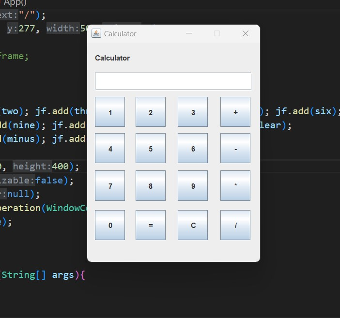

## Calculator Project with Java

After taking java class for 4 days! There is no use of OOP, and still learning it to apply in lot of projects!



```
import javax.swing.*;
import java.awt.event.*;

// objects
JFrame jf = new JFrame();
JButton btn = new JButton(String);
JTextField input = new JTextField();
JTextArea text_area = new JTextArea();
```
:) I think I got some knowledge ever than before from this project!